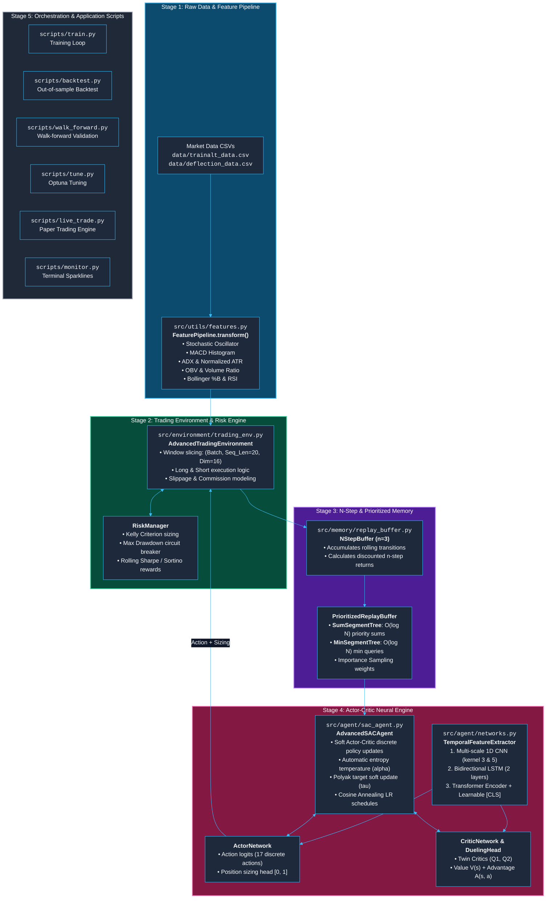
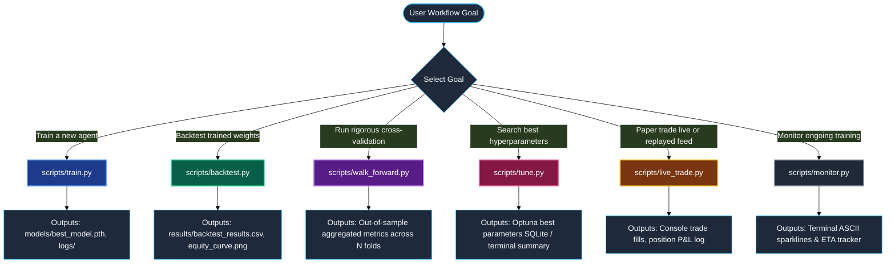

# Visual Architecture & File-by-File Blueprint: THE_RL_trading_BOT

> [!IMPORTANT]
> This guide details every file, data structure, tensor transformation, and execution pipeline in the repository. Use this reference to trace execution pathways from data ingestion to model inference.

---

## 1. High-Level System Architecture



---

## 2. Directory Matrix: What Goes Where

| Directory | Core Files | Responsibility | Inputs | Outputs |
| :--- | :--- | :--- | :--- | :--- |
| **`config/`** | `training_config.yaml`<br/>`quick_test_config.yaml`<br/>`medium_test_config.yaml`<br/>`no_transformer_test_config.yaml` | Declares all hyperparameters, network dimensions, sequence windows, training steps, and risk parameters. | Human edits / Optuna trials | Parameter dictionary passed into scripts and agents |
| **`data/`** | `trainalt_data.csv`<br/>`deflection_data.csv` | Historical market data. Must supply `date`, `close`, `open`, `high`, `low`, `volume`, plus initial signal columns. | Market data downloaders | Raw pandas DataFrames |
| **`src/utils/`** | `features.py` | Extracts stationary technical indicators and cleans warm-up NaNs from OHLCV series. | Raw OHLCV DataFrame | Enriched DataFrame with 16 features |
| **`src/environment/`**| `trading_env.py` | Gym-like step-by-step trading simulation environment with transaction costs, slippage, and portfolio tracking. | Feature data + Agent action | `(state_window, reward, done, info_dict)` |
| **`src/memory/`** | `replay_buffer.py` | Segment-tree prioritized experience replay buffer with n-step discounted reward accumulation. | Single-step transitions | Importance-sampled batches with indices and weights |
| **`src/agent/`** | `networks.py`<br/>`sac_agent.py` | Deep neural network architectures and Soft Actor-Critic algorithm logic with twin dueling critics. | Sampled experience batches | Action distributions, Q-values, weight gradient updates |
| **`scripts/`** | `train.py`<br/>`backtest.py`<br/>`walk_forward.py`<br/>`tune.py`<br/>`live_trade.py`<br/>`monitor.py` | Top-level runtime entry points that stitch together environments, agents, buffers, and evaluation metrics. | User command line invocations | Saved weights (`models/`), results CSVs (`results/`), TensorBoard logs (`logs/`) |

---

## 3. Training Loop Sequence: What Happens From Which File

```mermaid
%%{init: {'theme': 'base', 'themeVariables': { 'actorBkg': '#1e293b', 'actorBorder': '#38bdf8', 'actorTextColor': '#f8fafc', 'signalColor': '#38bdf8' }}}%%
sequenceDiagram
    autonumber
    participant CLI as Terminal / User
    participant Train as scripts/train.py
    participant Env as src/environment/trading_env.py
    participant Agent as src/agent/sac_agent.py
    participant Net as src/agent/networks.py
    participant Buffer as src/memory/replay_buffer.py
    participant Disk as models/ & logs/

    CLI->>Train: python scripts/train.py config/training_config.yaml
    Train->>Env: Initialize AdvancedTradingEnvironment(df, config)
    Train->>Agent: Initialize AdvancedSACAgent(state_dim=16, action_dim=17)
    Agent->>Net: Instantiate ActorNetwork & CriticNetwork(Twin Q)
    Train->>Buffer: Instantiate PrioritizedReplayBuffer(100k) + NStepBuffer(n=3)

    rect rgb(30, 41, 59)
    Note over Train,Buffer: Phase 1: Buffer Warmup (Random Actions)
    loop Until step >= warmup_steps (e.g. 1000)
        Train->>Env: step(random_action)
        Env-->>Train: next_state, reward, done, info
        Train->>Buffer: NStepBuffer.add(s, a, r, s', done)
        Buffer->>Buffer: Push full n-step transitions to PrioritizedReplayBuffer
    end
    end

    rect rgb(15, 23, 42)
    Note over Train,Buffer: Phase 2: Active SAC Optimization Loop
    loop Every Training Step
        Train->>Agent: select_action(state, deterministic=False)
        Agent->>Net: ActorNetwork.forward(state_tensor)
        Net-->>Agent: Action logits [B, 17] + Position size [B, 1]
        Agent-->>Train: Discrete Action index + Position fraction
        Train->>Env: step(action, position_size)
        Env-->>Train: next_state, reward, done, trade_info
        Train->>Buffer: NStepBuffer.add(s, a, r, s', done)
        
        Train->>Buffer: PrioritizedReplayBuffer.sample(batch_size=32, beta)
        Buffer-->>Train: Batch (states, actions, rewards, next_states, dones, weights, indices)
        Train->>Agent: update_parameters(batch)
        
        Agent->>Net: CriticNetwork Q1, Q2 forward pass
        Agent->>Net: Calculate N-step TD target with target entropy alpha
        Agent->>Buffer: update_priorities(indices, td_errors)
        Agent->>Net: Actor policy loss backward pass & gradient clip
        Agent->>Net: Temperature alpha loss backward pass
        Agent->>Net: Polyak soft target update (tau=0.005)
    end
    end

    rect rgb(30, 41, 59)
    Note over Train,Disk: Phase 3: Evaluation & Checkpointing
    Train->>Env: Run deterministic evaluation epoch
    Train->>Disk: Save best model checkpoint (models/best_model.pth)
    Train->>Disk: Log metrics (logs/events.out.tfevents.*)
    end
```



---

## 4. Feature Extraction & Tensor Shapes Pipeline

```mermaid
%%{init: {'theme': 'base', 'themeVariables': { 'primaryColor': '#1e293b', 'primaryTextColor': '#f8fafc', 'primaryBorderColor': '#38bdf8', 'lineColor': '#38bdf8' }}}%%
flowchart LR
    subgraph S1 ["1. Input Window"]
        RAW["Batch of Windows<br/><b>Shape: [32, 20, 16]</b><br/>[Batch, Seq_Len, Features]"]
    end

    subgraph S2 ["2. Multi-Scale 1D CNN"]
        PERM1["Permute to [B, F, T]<br/><b>Shape: [32, 16, 20]</b>"]
        C3["Conv1D (kernel=3, pad=1)<br/><b>Shape: [32, 128, 20]</b>"]
        C5["Conv1D (kernel=5, pad=2)<br/><b>Shape: [32, 128, 20]</b>"]
        CAT["Concat channels + LayerNorm<br/><b>Shape: [32, 256, 20]</b>"]
        PERM2["Permute to [B, T, H]<br/><b>Shape: [32, 20, 256]</b>"]
        RAW --> PERM1
        PERM1 --> C3
        PERM1 --> C5
        C3 --> CAT
        C5 --> CAT
        CAT --> PERM2
    end

    subgraph S3 ["3. Bidirectional LSTM"]
        LSTM["2-Layer BiLSTM<br/>Hidden: 128 each direction<br/><b>Shape: [32, 20, 256]</b>"]
        PERM2 --> LSTM
    end

    subgraph S4 ["4. Transformer Encoder"]
        CLS["Prepend [CLS] token<br/><b>Shape: [32, 21, 256]</b>"]
        POS["Positional Encoding<br/><b>Shape: [32, 21, 256]</b>"]
        TRANS["TransformerEncoder (2 layers, 4 heads)<br/><b>Shape: [32, 21, 256]</b>"]
        POOL["Temporal Pooling / CLS extraction<br/><b>Output: [32, 256]</b>"]
        LSTM --> CLS
        CLS --> POS
        POS --> TRANS
        TRANS --> POOL
    end

    subgraph S5 ["5. Network Heads"]
        ACT_H["Actor Head<br/>Linear(256→256) → LayerNorm → GELU → Linear(256→17)<br/><b>Action Logits: [32, 17]</b>"]
        POS_H["Position Size Head<br/>Linear(256→128) → GELU → Linear(128→1) → Sigmoid<br/><b>Size Scalar: [32, 1]</b>"]
        D_VAL["Value Stream V(s)<br/>Linear(256→256) → LayerNorm → GELU → Linear(256→1)<br/><b>State Value: [32, 1]</b>"]
        D_ADV["Advantage Stream A(s, a)<br/>Linear(256→256) → LayerNorm → GELU → Linear(256→17)<br/><b>Advantages: [32, 17]</b>"]
        Q_OUT["Dueling Output<br/>Q(s, a) = V(s) + A(s, a) - mean(A)<br/><b>Q-Values: [32, 17]</b>"]

        POOL --> ACT_H
        POOL --> POS_H
        POOL --> D_VAL
        POOL --> D_ADV
        D_VAL --> Q_OUT
        D_ADV --> Q_OUT
    end

    style S1 fill:#0f172a,stroke:#38bdf8,stroke-width:1px,color:#ffffff
    style S2 fill:#1e1e2e,stroke:#a855f7,stroke-width:1px,color:#ffffff
    style S3 fill:#14532d,stroke:#22c55e,stroke-width:1px,color:#ffffff
    style S4 fill:#701a75,stroke:#ec4899,stroke-width:1px,color:#ffffff
    style S5 fill:#7c2d12,stroke:#f97316,stroke-width:1px,color:#ffffff
```



---

## 5. Execution Scripts: When to Run Which Script



### Script Commands Reference

1. **Standard Model Training**
   ```bash
   python scripts/train.py config/training_config.yaml
   ```
2. **Terminal Metrics Monitor (Run in second terminal)**
   ```bash
   python scripts/monitor.py logs/
   ```
3. **Deterministic Backtesting**
   ```bash
   python scripts/backtest.py config/training_config.yaml models/best_model.pth 10000
   ```
4. **Walk-Forward Validation (No Lookahead Bias)**
   ```bash
   python scripts/walk_forward.py config/training_config.yaml
   ```
5. **Hyperparameter Tuning (Optuna)**
   ```bash
   python scripts/tune.py config/training_config.yaml --trials 50
   ```
6. **Live / Paper Replay Trading**
   ```bash
   python scripts/live_trade.py config/training_config.yaml models/best_model.pth --mode replay
   ```

---

## 6. Detailed File Breakdown & Source References

### 1. `src/utils/features.py`
* **Purpose**: Generates all numeric inputs used by the agent policy.
* **Key Function**: `FeaturePipeline.transform(df: pd.DataFrame) -> pd.DataFrame` (`src/utils/features.py:161`)
* **Indicators Computed**:
  * `compute_stochastic` (`src/utils/features.py:63`): Fast & slow stochastics for overbought/oversold levels.
  * `compute_macd` (`src/utils/features.py:56`): Moving Average Convergence Divergence line minus signal.
  * `compute_adx` (`src/utils/features.py:73`): Average Directional Index (trend strength indicator).
  * `compute_obv` (`src/utils/features.py:92`): On-Balance Volume normalized by rolling standard deviation.
  * `compute_atr_norm` (`src/utils/features.py:100`): Average True Range divided by close price.
  * `compute_log_return` (`src/utils/features.py:106`): $\ln(P_t / P_{t-1})$.
  * `compute_rsi` (`src/utils/features.py:48`): 14-period Relative Strength Index.
  * `compute_bollinger_pct` (`src/utils/features.py:110`): Bollinger %B position within 2-sigma bands.
  * `compute_volume_ratio` (`src/utils/features.py:119`): Volume relative to 20-period moving average.

### 2. `src/environment/trading_env.py`
* **Purpose**: The trading environment executing trades, calculating reward penalties, and holding portfolio balances.
* **Key Classes**:
  * `RiskManager` (`src/environment/trading_env.py:24`): Tracks drawdowns against `max_drawdown_limit` (default 0.15), applies Kelly fractional sizing (default 0.25), and halts episodes if drawdown is violated.
  * `AdvancedTradingEnvironment` (`src/environment/trading_env.py:64`): Manages the historical data cursor, sliding observation window, slippage and fee deduction, and returns risk-adjusted rewards (`sharpe`, `sortino`, or `shaped`).

### 3. `src/memory/replay_buffer.py`
* **Purpose**: Efficient memory storage and prioritized sampling.
* **Key Classes**:
  * `SumSegmentTree` (`src/memory/replay_buffer.py:18`): Binary tree holding cumulative priorities, allowing $O(\log N)$ sampling proportional to TD-errors.
  * `MinSegmentTree` (`src/memory/replay_buffer.py:52`): Binary tree tracking the lowest priority for importance sampling weight normalization.
  * `PrioritizedReplayBuffer` (`src/memory/replay_buffer.py:85`): Manages transition storage with importance-sampling exponent $\beta$ annealing.
  * `NStepBuffer` (`src/memory/replay_buffer.py:192`): Rolling deque accumulating $n=3$ transitions, calculating discounted reward sum:
    $$R^{(n)}_t = \sum_{k=0}^{n-1} \gamma^k r_{t+k}$$

### 4. `src/agent/networks.py`
* **Purpose**: PyTorch deep learning modules.
* **Key Classes**:
  * `PositionalEncoding` (`src/agent/networks.py:24`): Sinusoidal position vectors injected into transformer inputs.
  * `TemporalFeatureExtractor` (`src/agent/networks.py:50`): Parallel Conv1d(3) + Conv1d(5) -> LayerNorm -> BiLSTM(2 layers) -> TransformerEncoder.
  * `DuelingHead` (`src/agent/networks.py:136`): Separates state value stream $V(s)$ and advantage stream $A(s, a)$.
  * `ActorNetwork` (`src/agent/networks.py:174`): Outputs discrete action logits over 17 bins and continuous position sizing scalar.
  * `CriticNetwork` (`src/agent/networks.py:232`): Computes dueling Q-values from extracted temporal embeddings.

### 5. `src/agent/sac_agent.py`
* **Purpose**: SAC agent training loop, loss calculation, and target updating.
* **Key Class**: `AdvancedSACAgent` (`src/agent/sac_agent.py:25`)
  * `select_action()`: Samples categorical distribution during training or takes argmax during evaluation.
  * `update_parameters()`: Computes twin critic loss, updates segment-tree priorities using TD errors, updates actor policy loss, tunes entropy temperature $\alpha$, and runs Polyak averaging on target critics:
    $$\theta_{\text{target}} \leftarrow \tau \theta + (1 - \tau)\theta_{\text{target}}$$
