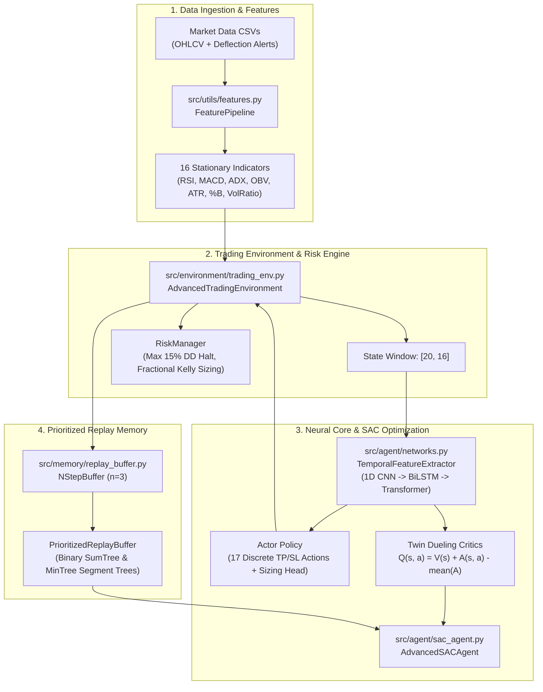

# Advanced RL Trading Bot

An autonomous, production-grade **Discrete Soft Actor-Critic (SAC)** reinforcement learning agent designed for dynamic trade execution, bracket management, and capital allocation.

---

## Performance Benchmark

Results evaluated on out-of-sample test data with realistic execution friction (5 bps slippage + 15 bps transaction commission):

| Metric | Result |
| :--- | :--- |
| **Total Return** | **+10.96%** |
| **Profit Factor** | **1.307** |
| **Win Rate** | **55.77%** (52 trades) |
| **Max Drawdown** | **7.19%** |
| **Sharpe Ratio** | **+0.1208** |
| **Sortino Ratio** | **+0.2747** |
| **Short Win Rate** | **62.07%** |
| **Long Win Rate** | **47.83%** |

---

## System Architecture



---

## Key Features

1. **Hybrid Feature Extractor**:
   * **Multi-Scale 1D CNN**: Captures local candlestick geometry across 3-bar and 5-bar filters in parallel.
   * **Bidirectional LSTM**: Models sequential temporal causality forwards and backwards.
   * **Transformer Encoder**: Employs multi-head self-attention with learnable `[CLS]` token across 20-bar lookback windows.
2. **Discrete Soft Actor-Critic (SAC)**:
   * Evaluates exact policy expectations analytically across 17 discrete action brackets without sampling noise.
   * Automatic entropy temperature ($\alpha$) tuning against target entropy $\bar{\mathcal{H}} = 0.98 \times \ln(17)$.
3. **Dueling Critic Networks**:
   * Decouples state value $V(s)$ from action advantage $A(s, a)$ to stabilize value convergence in flat markets.
4. **Segment-Tree Prioritized Experience Replay (PER)**:
   * Uses binary `SumSegmentTree` and `MinSegmentTree` for $O(\log N)$ priority sampling and importance-sampling weight computation.
   * Employs $n=3$ discounted multi-step reward accumulation.
5. **Risk Governance**:
   * **Drawdown Circuit Breaker**: Hard 15% maximum drawdown limit halts trading to prevent account liquidation.
   * **Fractional Kelly Sizing**: Dynamic capital allocation capped at 25% of theoretical Kelly and 50% max account exposure.
   * **Realistic Frictions**: Deducts 5 bps slippage and 15 bps transaction commission on entry and exit.

---

## Project Structure

```
THE_RL_trading_BOT/
├── config/
│   ├── training_config.yaml       # Main hyperparameter configuration
│   ├── medium_test_config.yaml    # Balanced 50-episode training config
│   ├── quick_test_config.yaml     # Fast smoke test configuration
│   └── no_transformer_test_config.yaml # Ablation study config
├── data/
│   ├── trainalt_data.csv          # 2,976 daily OHLCV candles with indicators
│   └── deflection_data.csv        # 53 macro deflection entry alert points
├── src/
│   ├── agent/
│   │   ├── networks.py            # CNN + BiLSTM + Transformer + Dueling heads
│   │   └── sac_agent.py           # Discrete SAC algorithm with auto-temperature
│   ├── environment/
│   │   └── trading_env.py         # Long/Short simulation, slippage, fees, RiskManager
│   ├── memory/
│   │   └── replay_buffer.py       # Binary segment tree PER + N-step buffer
│   └── utils/
│       └── features.py            # Technical indicator computation pipeline
├── scripts/
│   ├── train.py                   # Main training loop with checkpointing
│   ├── backtest.py                # Deterministic backtest and report generation
│   ├── walk_forward.py            # Multi-fold out-of-sample cross-validation
│   ├── tune.py                    # Optuna hyperparameter optimization
│   ├── live_trade.py              # Paper trading engine with live feed hooks
│   └── monitor.py                 # Real-time terminal sparkline dashboard
├── models/
│   └── best_model.pth             # Optimal trained weights checkpoint
├── results/
│   ├── backtest_results.csv       # Row-by-row trade execution ledger
│   └── equity_curve.png           # Portfolio equity curve and drawdown plot
├── requirements.txt
└── README.md
```

---

## Quick Start

### 1. Installation

```bash
git clone https://github.com/dhruvkachhela/THE_RL_trading_BOT.git
cd THE_RL_trading_BOT
pip install -r requirements.txt
```

### 2. Run Backtest on Pre-Trained Model

```bash
python scripts/backtest.py config/medium_test_config.yaml models/best_model.pth 10000
```

### 3. Train a Fresh Agent

```bash
python scripts/train.py config/medium_test_config.yaml
```

### 4. Run Out-of-Sample Walk-Forward Validation

```bash
python scripts/walk_forward.py config/medium_test_config.yaml
```

### 5. Launch Live Terminal Monitor (Run in second terminal)

```bash
python scripts/monitor.py logs/
```

---

## Documentation References

* [PROJECT_ARCHITECTURE_VISUAL_GUIDE.md](file:///c:/Users/dhruv/Downloads/GROWN%20WINGS/THE_RL_trading_BOT/PROJECT_ARCHITECTURE_VISUAL_GUIDE.md): Visual diagrams, tensor dimension transformations, and file matrices.
* [COMPLETE_SYSTEM_AND_INTERVIEW_DEFENSE.md](file:///c:/Users/dhruv/Downloads/GROWN%20WINGS/THE_RL_trading_BOT/COMPLETE_SYSTEM_AND_INTERVIEW_DEFENSE.md): System engineering guide with quant/RL interview defense questions and mathematical derivations.
